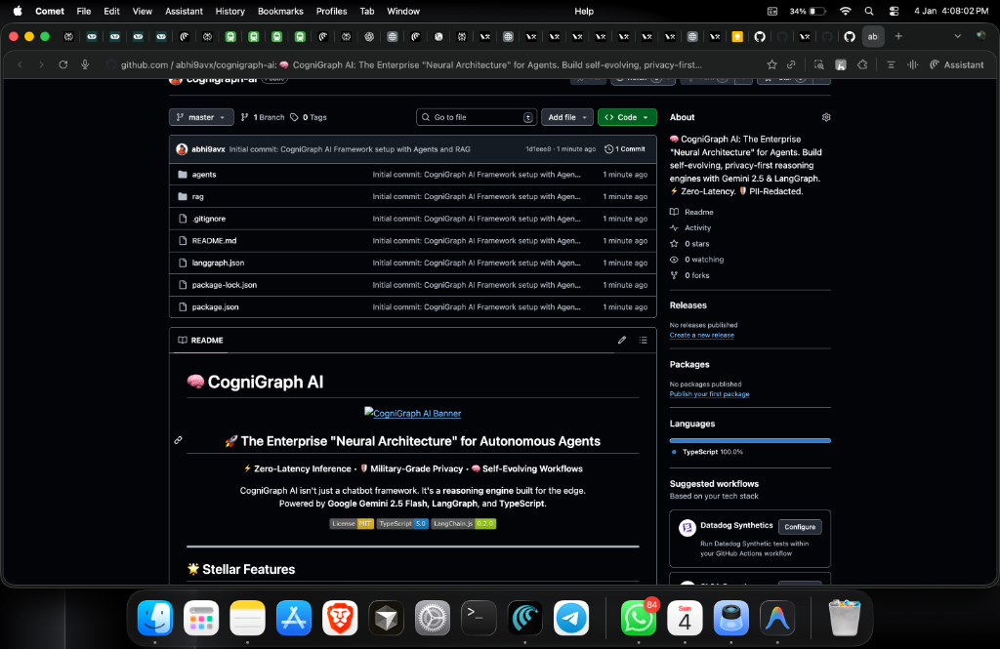
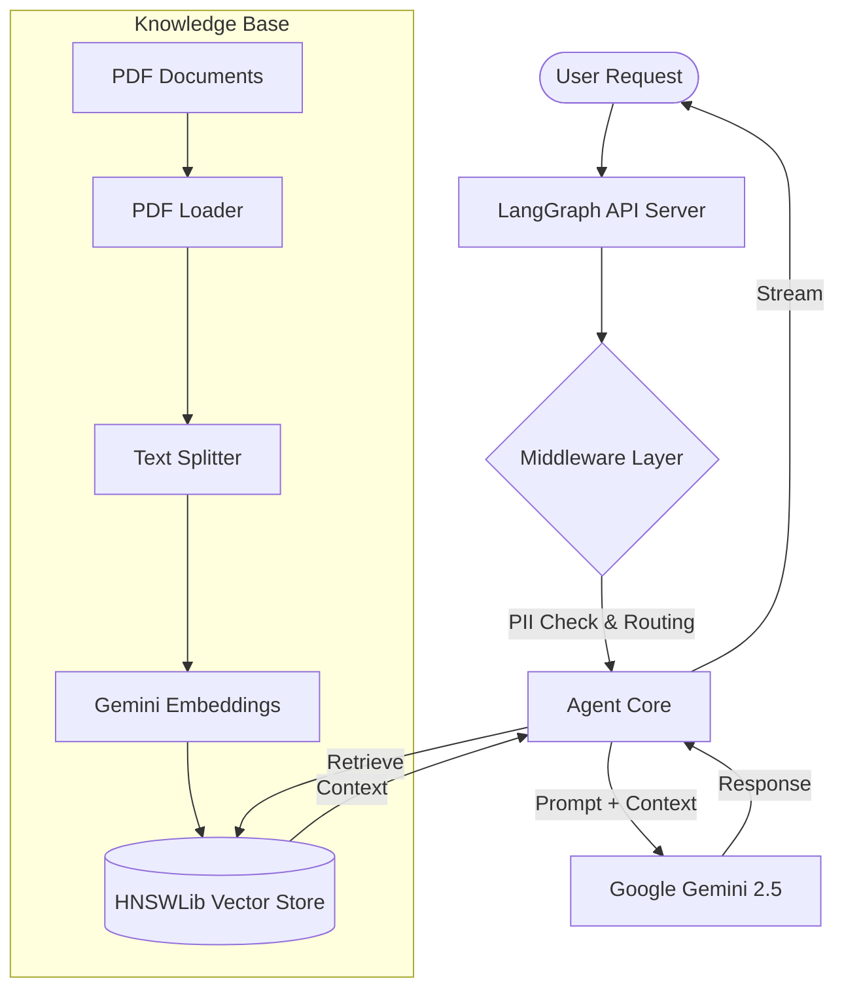
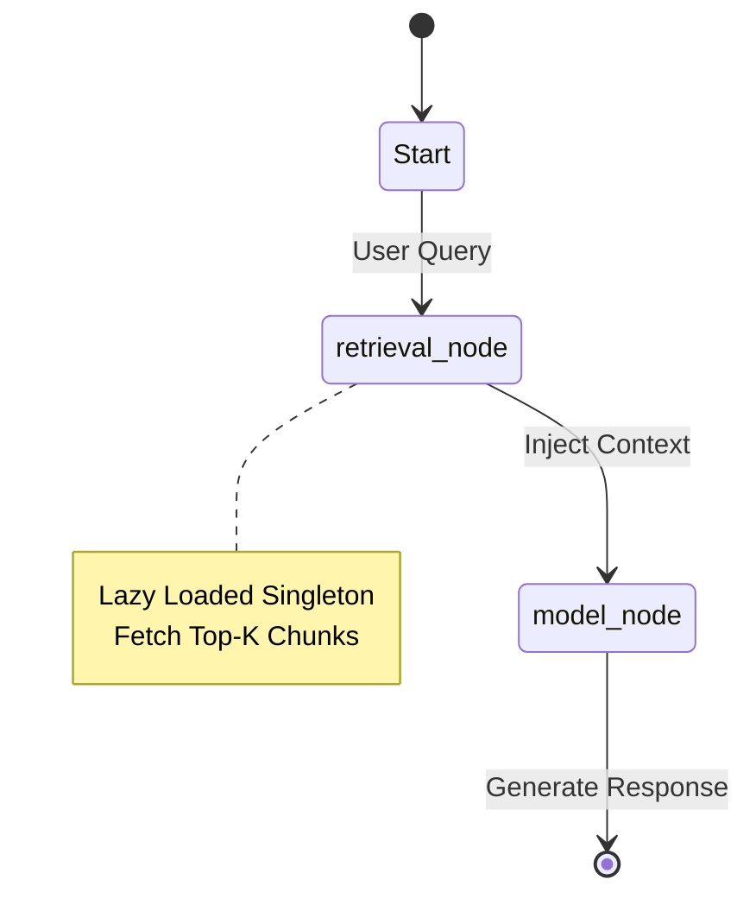

# 🧠 CogniGraph AI

<div align="center">
  
</div>

<div align="center">
  <h2>🚀 The Enterprise "Neural Architecture" for Autonomous Agents</h2>
  <p>
     <strong>⚡ Zero-Latency Inference</strong> • <strong>🛡️ Military-Grade Privacy</strong> • <strong>🧠 Self-Evolving Workflows</strong>
  </p>
  <p>
    CogniGraph AI isn't just a chatbot framework. It's a <strong>reasoning engine</strong> built for the edge.
    <br>
    Powered by <strong>Google Gemini 2.5 Flash</strong>, <strong>LangGraph</strong>, and <strong>TypeScript</strong>.
  </p>
  
  [](https://opensource.org/licenses/MIT)
  [](https://www.typescriptlang.org/)
  [](https://js.langchain.com/)
  
</div>

---

## 🌟 Stellar Features

The **CogniGraph AI** framework is not just a chat bot; it is a sophisticated **reasoning engine**.

*   **⚡ Zero-Latency Inference**: Leveraging `gemini-2.5-flash` for near-instantaneous responses, optimized for real-time edge applications.
*   **🛡️ Enterprise-Grade Security**: Built-in **PII Redaction Middleware** ensures sensitive data (SSNs, Phones) never hits the model providers.
*   **🧠 Infinite Context Memory**: Uses `MemorySaver` checkpointers to maintain state across sessions, essentially giving the agent "Long-Term Memory."
*   **📐 Structured Determinism**: Enforces strictly typed JSON outputs using **Zod Validation**, eliminating hallucinations in critical business flows.
*   **🔎 RAG Intelligence**: Seamlessly connects to **PDF Knowledge Bases** via HNSWLib vector stores for grounded, factual answers.
*   **🔄 Resilience & Fallback**: Automatically switches to more powerful models (`Gemini Pro`) if the lighter model fails or output quality drops.

---

## 🧠 Deep Dive: AI Terminology & Concepts

New to the AI Engineering world? Here is your cheat sheet:

### 📖 RAG (Retrieval Augmented Generation)
**The Analogy:** Imagine taking a test.
*   **LLM (ChatGPT/Gemini):** A student trying to answer from memory. Reliable but can hallucinate or be outdated.
*   **RAG:** Giving that student an open textbook (your PDF data) to search through before answering.
*   **Result:** Answers are **grounded**, factual, and specific to your private data.

### 🔢 Embeddings & Vectors
Computers don't understand text; they understand numbers.
*   **Embedding Model:** Converts a sentence like "Nike's revenue" into a long list of numbers (e.g., `[0.1, -0.5, 0.8...]`).
*   **Semantic Search:** We don't just match keywords. We find "numbers" that are close to each other. So "Runner's shoes" will match "Nike Pegasus" even if the words share no common letters.

### 🤖 Agentic Workflow
Standard LLMs are **Passive** (Input -> Output).
**Agents** are **Active** Loops (Input -> Thought -> Action -> Observation -> Thought -> Output).
They can correct their own mistakes, research a topic for hours, or write code to solve a problem.

### 🔌 MCP (Model Context Protocol) 🆕
**The New Standard:** Currently, connecting an Agent to a Database requires writing custom API code.
**MCP** is an open standard (like USB for AI) that lets AI models connect to *any* data source (Slack, GitHub, PostgreSQL) repeatedly without custom glue code. It is the future of interoperability.

---

## 🔮 Upcoming Roadmap

We are constantly pushing the boundaries of Agentic AI. Next in the pipeline:

-   [ ] **Agentic RAG**: Moving beyond static retrieval to "Active Research," where the agent iteratively queries, filters, and summarizes documents.
-   [ ] **MCP (Model Context Protocol)**: Universal standard for connecting AI agents to external databases and tools without custom integrations.
-   [ ] **Multi-Agent Orchestration**: A "Supervisor" agent managing sub-agents (Coder, Researcher, Reviewer) for complex tasks.
-   [ ] **Voice Mode**: Real-time audio-to-audio interaction support.

---

## 🛠️ Performance Tech Stack

We chose this stack for maximum **throughput** and **developer experience**:

| Component | Choice | Why we chose it? |
| :--- | :--- | :--- |
| **LLM Engine** | **Google Gemini 2.5 Flash** | Significantly faster and cheaper than GPT-4o while maintaining high reasoning capabilities. |
| **Orchestrator** | **LangGraph** | Provides cyclic, stateful control flows (loops) which linear `Chains` cannot handle. |
| **Vector DB** | **HNSWLib (In-Memory)** | Ultra-fast approximate nearest neighbor search without the overhead of an external DB server like Pinecone. |
| **Runtime** | **Node.js / TypeScript** | Ensures type safety across the entire stack, preventing runtime errors in complex logic flows. |
| **Tracing** | **LangSmith** | Full observability into agent "thoughts," latency, and token usage for optimization. |

---

## 🏗️ Core Architecture & Design Patterns

### 🧩 High-Level Design (HLD)



The system follows a **Graph-based State Machine** architecture:
1.  **Input**: User sends a JSON payload.
2.  **State**: The "Graph State" (Messages object) acts as the single source of truth.
3.  **Nodes**: Functional units (Retrieval, Tool Calling, Generation) process the state.
4.  **Edges**: Conditional logic determines the next step (e.g., *Does the output contain a tool call?* -> Go to ToolNode).
5.  **Output**: Final response streamed back to the client.

### ⚙️ Low-Level Design (LLD)



*   **Singleton Pattern**: Used for the Vector Store initialization (`getVectorStore`) to prevent expensive re-indexing on every request.
*   **Middleware Pattern**: We intercept requests for PII scrubbing and dynamic model routing before they reach the core logic.
*   **Factory Pattern**: `createAgent` functions encapsulate complex graph setup, making instantiation clean and repeatable.
*   **Lazy Loading**: Heavy resources (PDF parsers) are loaded only when required, optimizing server startup time.

---

## 🚀 Setup & Execution

### 1. Installation
```bash
# Clone the repository
git clone https://github.com/your-repo/cognigraph-ai.git

# Install dependencies
npm install

# Setup environment
cp .env.example .env
# Add your GOOGLE_API_KEY
```

### 2. Development Mode (LangGraph Studio)
For the full visual debugging experience:
```bash
npx langgraphjs dev
```
Use the **LangSmith Studio** link printed in the terminal to inspect your agent's decision-making process visually.

### 3. CLI Execution
Run specific agent evolutions directly in the terminal:
```bash
npx tsx agents/agent5.ts  # Runs the Dynamic Model agent
npx tsx rag/ragagent1.ts  # Runs the CLI version of RAG
```

---

<div align="center">
  <p>For detailed documentation, visit the <a href="https://js.langchain.com">LangChain JS Docs</a>.</p>
  <i>Crafted with precision for the next generation of AI Engineers.</i>
</div>
